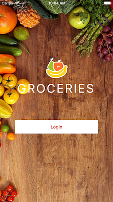
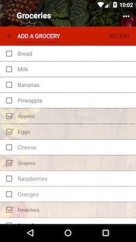

# Groceries 

Groceries is a NativeScript-built iOS and Android app for managing grocery lists. 

<h2 id="screenshots">Screenshots</h2>






<h2 id="development">Development</h2>

This app is built with the NativeScript CLI. Once you have the [CLI installed](https://docs.nativescript.org/start/quick-setup), start by cloning the repo:

```
$ git clone https://github.com/gauravbhanderi231/HHI-BPM.git
$ cd sample-Groceries
```

From there you can use the `run` command to run Groceries on iOS:

```
$ tns run ios
```

And the same command to run Groceries on Android:

```
$ tns run android
```

<h3 id="linting">Linting</h3>

Groceries uses [tslint](https://www.npmjs.com/package/tslint) + [codelyzer](https://github.com/mgechev/codelyzer) rules to ensure the code follows the [angular style guide](https://angular.io/docs/ts/latest/guide/style-guide.html).

You can run the linter with the `tslint` npm script:
```
$ npm run tslint
```

<h3 id="unit-testing">Unit Testing</h3>

Groceries uses NativeScript’s [integrated unit test runner](http://docs.nativescript.org/core-concepts/testing) with [Jasmine](http://jasmine.github.io/). To run the tests for yourself use the `tns test` command:

```
$ tns test ios --emulator
```

```
$ tns test android --emulator
```

For more information on unit testing NativeScript apps, refer to the [NativeScript docs on the topic](http://docs.nativescript.org/core-concepts/testing).

<h3 id="travis">Travis CI</h3>

Groceries uses [Travis CI](https://travis-ci.org/) to verify all tests pass on each commit. Refer to the [`.travis.yml` configuration file](https://github.com/NativeScript/sample-Groceries/blob/master/.travis.yml) for details.

<h3 id="telerik-platform">Telerik Platform</h3>

If you’d like to try developing Groceries without going through the full setup, you may be interested in loading the app in the [Telerik Platform](http://www.telerik.com/platform):

* [Run Groceries in the Telerik Platform](https://platform.telerik.com/#appbuilder/clone/https%3A%2F%2Fgithub.com%2FIcenium%2Fnativescript-sample-groceries)


<!-- Note: The table above get generated with the following commands -->
<!-- npm install -g github-contributors-list -->
<!-- githubcontrib --owner NativeScript --repo sample-Groceries --cols 6 --sortOrder desc | pbcopy -->


